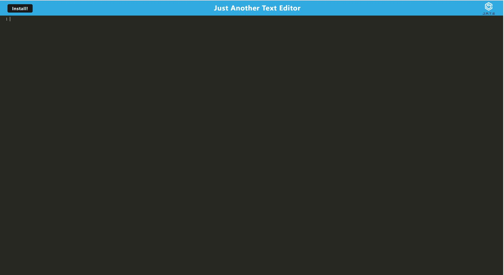

# Progressive Web Application - Text Editor
This application is deployed on Heroku. Check out online [HERE](https://safe-chamber-86791.herokuapp.com/)

## Table of Contents
* [Desciption](#description)
* [Installation](#installation)
* [Usage](#usage)
* [Contribution](#contribution)
* [Test](#test)
* [Questions](#questions)

## Description

This is a command line-based application. User can view the notes in the database and add new notes. This application is powered by node.js

## Installation

Please install node.js on your local machine. Make sure you have all the dependencies required for the application, including express, babel, webpack, and IDB

## Usage

This application is deployed on Heroku. Enter 'npm run start' in git bash (windows) /terminal (Mac) to start the application on your local machine. 

## Contribution

Please let me know if you have any advice

## Test

no test for this application

## Mock Up

## Questions

Please contact me if you have any questions.
Email: jiongw22@gmail.com
GitHub: [aurorayihe](http://github.com/aurorayihe)

